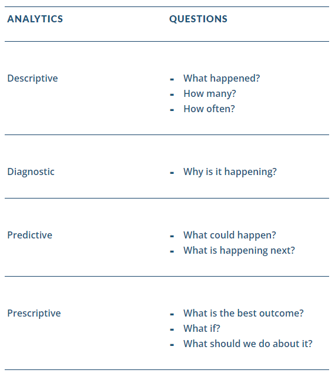

### Types of Analytics

Descriptive Analytics - Descriptive analytics uses current and historical data to identify trends and relationships.

Diagnostic Analytics
Diagnostic analytics takes descriptive analytics one step further by diagnosing why something is happening in the data. This could be understanding why a trend arises or why a problem has occurred.

Predictive Analytics
Predictive analytics uses past information along with the underlying background information of the data in order to predict what may occur in the future. 

Prescriptive Analytics
Prescriptive analytics focuses on what should be done or what can be done to make something happen. This takes predictions one step further in uncovering truly meaningful business insights. It also means interpreting how to solve the problem at hand or realizing a valuable new opportunity for a company

### What analytics should you use

Data Analytics Lifecycle

### Project Manager vs. Business Analyst

### The Project Charter for Business Analytics Projects
A project charter is a short document that describes the project and authorizes the start of the project. The charter serves as the foundation for the project, and it is used for planning and resourcing.
1. Authorize the project's existence.
2. Formally provide the project with the sponsor's/organization's commitment.
3. Document a direct link between the project and the strategic objectives of the organization.

Data literacy is the ability to comprehend, analyze and communicate about data. Comprehending data means understanding data in context to its uses, methods, and results. 